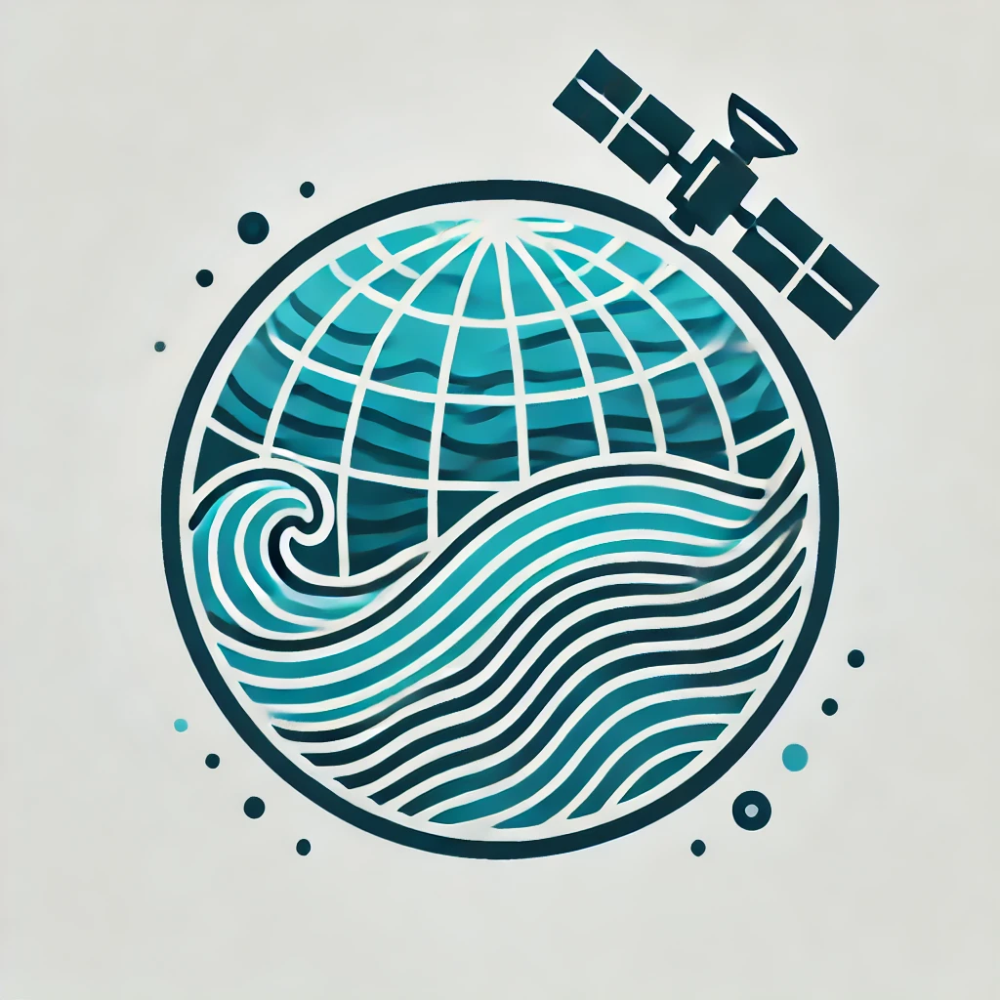

 

# SWOT Ocean Model Intercomparison Project

This repository is the entry point  for a  collaborative project aiming at assessing the representation of ocean mesoscale variability in ocean models using SWOT altimeter data. Here, you will find the instructions and routines that will facilitate your contribution.

## Science objective
We propose a model intercomparison project to:
* Describe the seasonal variability of the mesoscale kinetic energy (KE) over the global ocean from SWOT altimeter.
* Evaluate the performance of a variety of numerical ocean models in capturing this variability.
* Better understand the main mechanisms driving the space and time variability of mesoscale ocean dynamics.

## Motivation
Mesoscale ocean dynamics ( O(100 km) and O(10-100 days))  play an important role in ocean circulation, air-sea interactions, global tracer transport and climate. In situ observations, satellite altimetry and ocean numerical models show significant spatial and seasonal variability at this scale. Despite significant progress over the last decade, it still  is unclear whether the simulations adequately reproduce mesoscale variability, as well as the main mechanisms controlling spatial and temporal variability. The Surface Water and Ocean Topography (SWOT) altimeter mission offers an unprecedented opportunity to document (sub)mesoscale variability and assess the ability of models to capture it.
The aim of this project is to analyze the KE spectrum using SWOT SSH and several ocean simulations to describe the spatial and seasonal variability.

## How this works
Interest research groups are invited to provide ocean model data following our data request.  

Our group at IGE (Grenoble, France) will lead the analysis and share the results. All the communications will be orchestrated openly through  GitHub. The end result of this effort will be a collective paper involving all contributors.

## How to contribute 
If you are interested, please follow these steps:
1. Check the [Terms and conditions of the agreements](https://github.com/meom-group/swot-ocean-model-intercomparison-project/blob/main/Agreements.rst).
2. Verify that your simulations meet the [requirements](https://github.com/meom-group/swot-ocean-model-intercomparison-project/blob/main/ocean-model-requirements.md)
3. Raise a github issue for letting us know that you are interested.
4. Preparing your data following these instructions [instructions](https://github.com/meom-group/swot-ocean-model-intercomparison-project/blob/main/processing-instructions.md)
5. Complete the information requested in the  [metadata](https://github.com/meom-group/swot-ocean-model-intercomparison-project/blob/main/metadata-instructions.md)
6. Submit your dataset(s) following this instructions (link)

## Organizers
Micael Aguedjou, Amine Ouhechou, Julien Le Sommer, Marcela Contreras

## Licence
CC-BY
