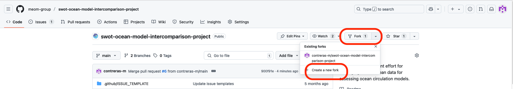
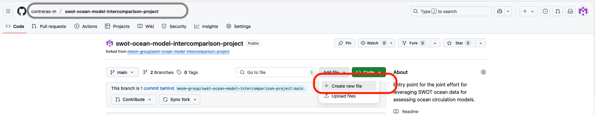
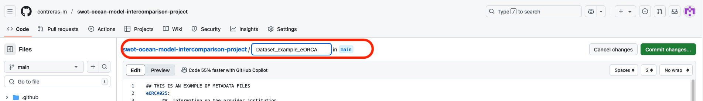
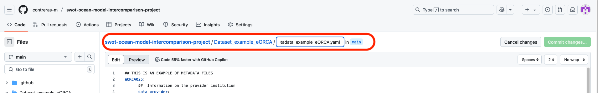
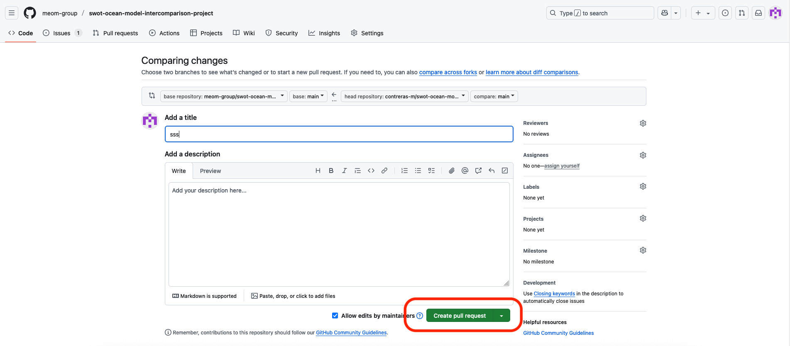

Metadata instruction
-----------------
The steps for submitting the required metadata are described below. An example of a metadata file is available [here](https://github.com/meom-group/swot-ocean-model-intercomparison-project/tree/main/Dataset_example_eORCA)

1. Create a new fork.

2. In your fork, add a new file 

3. Name the new directory and metadata of your dataset.

4.  Copy and paste the metadata template and fill with your information (see [template](https://github.com/meom-group/swot-ocean-model-intercomparison-project/blob/main/Dataset_template/metadata_template.yaml).
   
5. Commit the changes.

7.  Verify that you have created a new directory with a correctly filled-out metadata file.
   
9.  Pull request.

11.  And wait for our confirmation.
